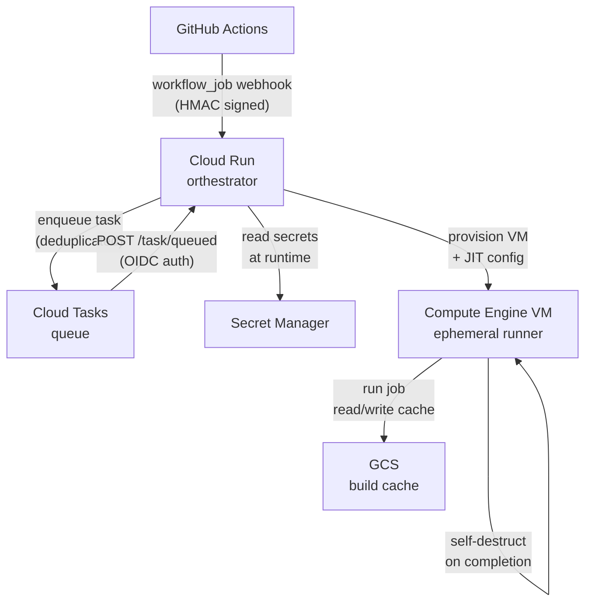
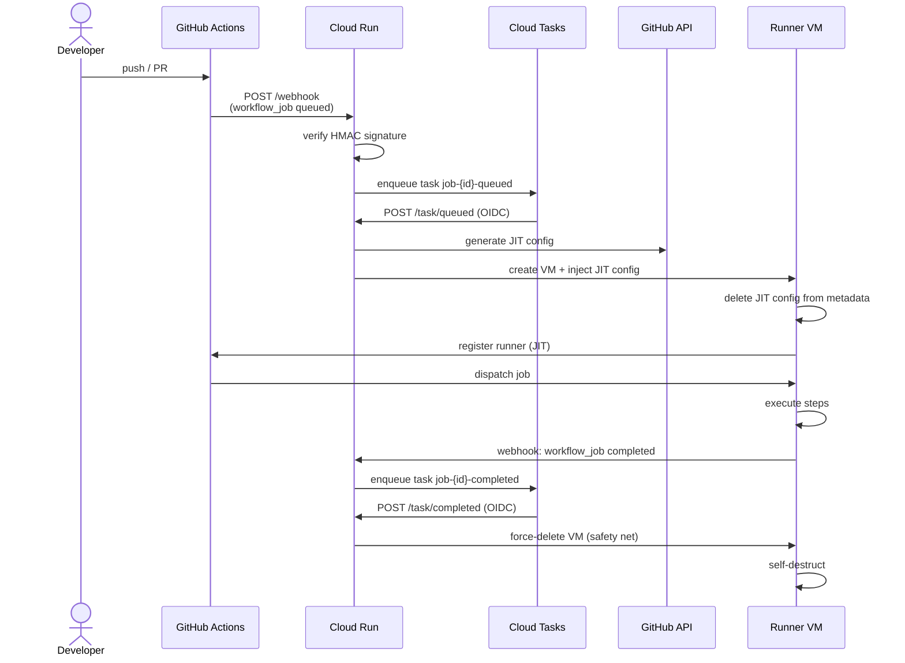
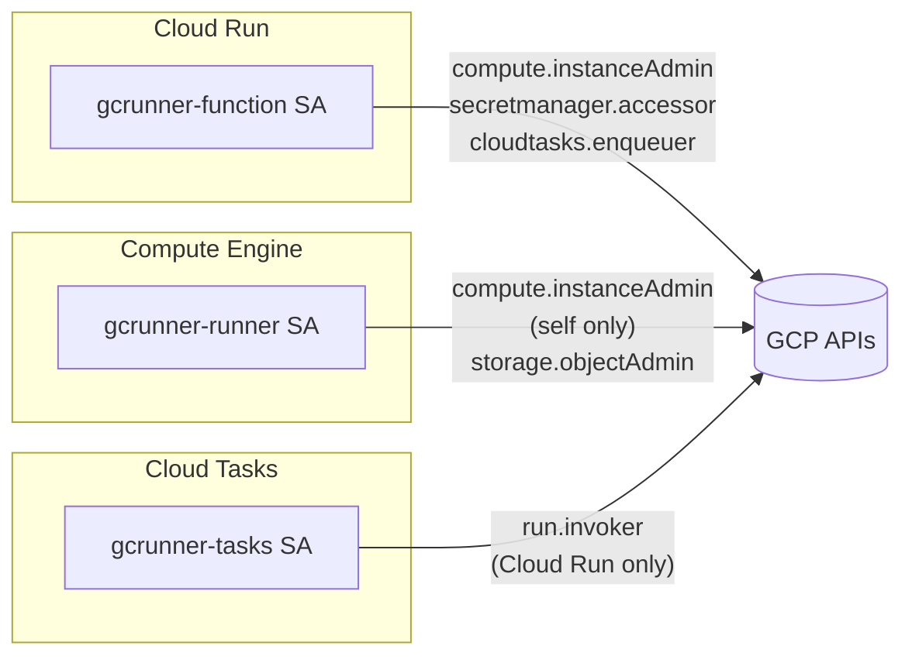
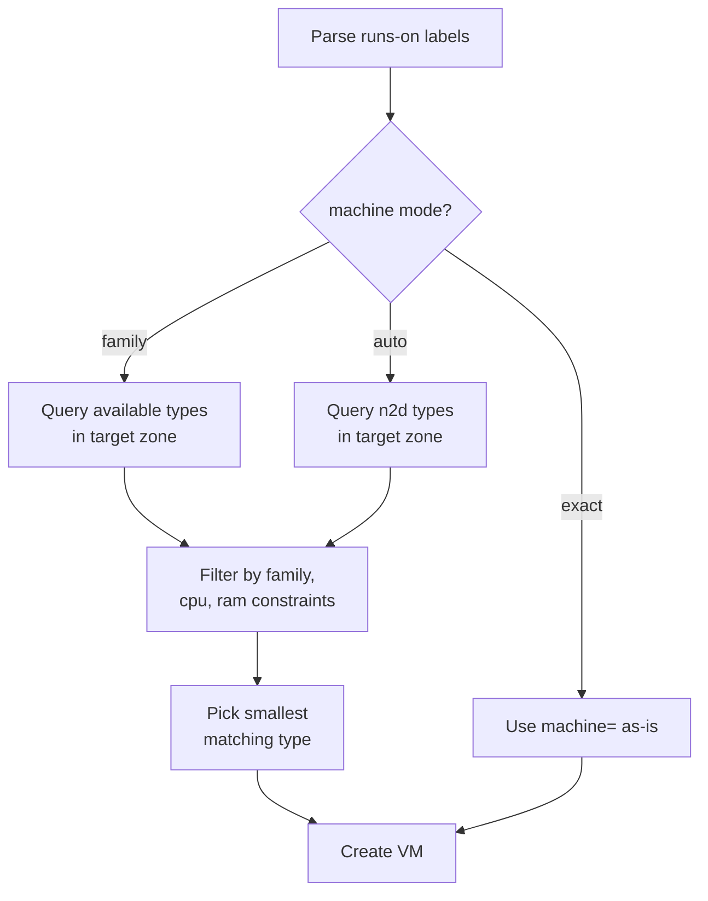
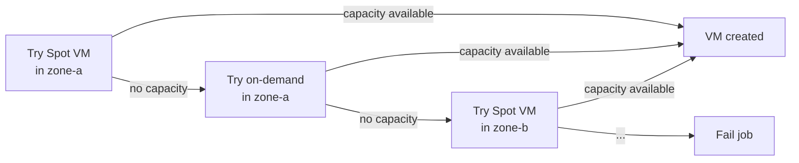

# Architecture

gcrunner is built entirely on managed GCP services. There are no persistent servers to operate — just a Cloud Run service that wakes up on demand, provisions an ephemeral VM, and goes back to sleep.

## Overview

## Job Lifecycle

Each workflow job goes through five stages: webhook receipt, task enqueue, VM provisioning, job execution, and teardown.

## Components

### Cloud Run (orchestrator)

The orchestrator is the only always-on component (though it scales to zero when idle). It handles three responsibilities:

- **`/webhook`** — Receives `workflow_job` events from GitHub, verifies the HMAC signature, and enqueues a Cloud Tasks task.
- **`/task/queued`** — Provisions a new ephemeral VM for the job. Called by Cloud Tasks, authenticated with OIDC.
- **`/task/completed`** — Force-deletes the VM as a safety net after job completion. Called by Cloud Tasks, authenticated with OIDC.

Secrets (GitHub App credentials, webhook secret) are read from Secret Manager at runtime — never stored in environment variables or config files.

### Cloud Tasks (queue)

Cloud Tasks sits between the incoming webhook and the VM provisioning logic. This decoupling provides two important properties:

- **Deduplication** — Task names are derived from the job ID (`job-{id}-queued`). If GitHub retries a webhook, the duplicate task is rejected, so only one VM is ever created per job.
- **Reliability** — Tasks are retried automatically (up to 5 attempts with exponential backoff) if the orchestrator is temporarily unavailable.

### Compute Engine VMs (runners)

VMs are ephemeral — one per job, created on demand, destroyed on completion. Each VM:

1. Boots from an immutable runner image (Ubuntu 24.04 or 22.04).
2. Reads the JIT runner config from the instance metadata server, then immediately deletes it.
3. Optionally starts the local cache server if a GCS bucket is configured.
4. Registers with GitHub and picks up the job.
5. Deletes itself when the job finishes.

The boot disk is set to auto-delete, so no data persists after the VM is gone.

### Secret Manager

Four secrets are stored and never appear in Terraform state or logs:

| Secret | Purpose |
|---|---|
| `gcrunner-app-id` | GitHub App ID |
| `gcrunner-private-key` | GitHub App RSA private key (used to sign JWTs) |
| `gcrunner-webhook-secret` | HMAC key for webhook signature verification |
| `gcrunner-setup-token` | One-time token protecting the setup endpoint |

### GCS Cache Bucket

Each VM runs a local cache server that proxies GitHub Actions cache API calls to GCS. This gives jobs a fast, persistent build cache without any external dependencies. The cache server is scoped per repository (owner + repo), so cache entries don't bleed between repos.

## Infrastructure

All GCP resources are managed by Terraform.

Three service accounts are used, each scoped to exactly what it needs:

| Service Account | Used by | Key permissions |
|---|---|---|
| `gcrunner-function` | Cloud Run orchestrator | Create/delete VMs, read secrets, enqueue tasks |
| `gcrunner-runner` | Runner VMs | Delete itself, read/write cache bucket |
| `gcrunner-tasks` | Cloud Tasks | Invoke Cloud Run `/task/*` endpoints |

## Machine Type Resolution

When a job uses `family` or `cpu`/`ram` labels instead of an exact machine type, the orchestrator queries the Compute Engine API to find the smallest available machine that satisfies the constraints. The result is cached per zone for one hour to avoid redundant API calls.

## Spot VM Fallback

Spot VMs are used by default. If Spot capacity is unavailable in a zone, the orchestrator automatically retries with an on-demand VM. If the target zone has no capacity at all, it moves to the next available zone in the region.

